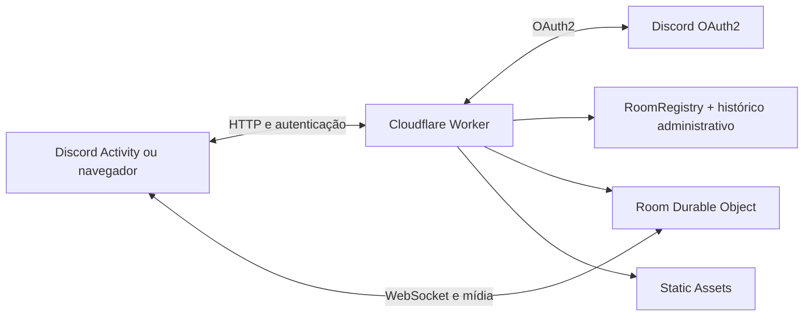

<div align="center">
  

  <h1>Screen Share</h1>

  <p><strong>Compartilhamento de tela simples e em tempo real para comunidades no Discord.</strong></p>

  <p>
    Uma Discord Activity desenvolvida para estudos, aulas, reuniões e trabalhos em grupo,<br>
    com backend serverless hospedado na Cloudflare.
  </p>

  <p>
    
    
    
    
  </p>

  <p>
    <a href="https://discord-screen.wendellsilvaa012.workers.dev/changelog/install">
      
    </a>
    <a href="https://discord-screen.wendellsilvaa012.workers.dev">
      
    </a>
  </p>

  <p>
    <a href="https://discord-screen.wendellsilvaa012.workers.dev/termos">Termos de uso</a>
    ·
    <a href="https://discord-screen.wendellsilvaa012.workers.dev/privacidade">Privacidade</a>
    ·
    <a href="docs/como-funciona.md">Documentação técnica</a>
    ·
    <a href="docs/hospedagem-do-zero.md">Hospede sua versão</a>
  </p>
</div>

---

## Sobre o projeto

O **Screen Share** é uma aplicação comunitária de compartilhamento de tela integrada ao Discord. Depois que a atividade é instalada, os participantes entram em um canal de voz, abrem o Screen Share pelo menu de Aplicativos/Atividades e são colocados automaticamente na mesma sala.

Quem deseja transmitir clica em **Compartilhar tela** e escolhe uma tela, janela ou aba do navegador. O vídeo é comprimido no próprio computador, enviado em tempo real e reproduzido para as outras pessoas que estiverem com a atividade aberta.

O projeto também possui uma versão web. Nela é possível criar salas públicas ou privadas, proteger uma sala com senha e compartilhar um convite direto.

> O Screen Share não grava nem armazena o conteúdo das transmissões. Os pacotes de áudio e vídeo são apenas retransmitidos em tempo real.

## 💜 Apoie o projeto

O Screen Share é mantido de forma independente. As contribuições ajudam a manter a infraestrutura disponível e permitem continuar desenvolvendo correções e novas funcionalidades.

**Apoiadores recebem benefícios exclusivos**, divulgados nos canais oficiais do projeto. O apoio é opcional e o aplicativo continua disponível normalmente para toda a comunidade.

<div align="center">
  <a href="https://wise.com/pay/me/wendelld173">
    
  </a>
  <a href="https://www.paypal.com/qrcodes/p2pqrc/TJ8SUKSF65WF6">
    
  </a>
</div>

### Pix

- **Chave aleatória:** `b4be56b2-502c-43bc-b716-b66c9c883737`
- **Beneficiário:** Wendell Diogo Mesquita da Silva
- **Valor:** livre, definido por quem está apoiando

<details>
<summary><strong>Mostrar Pix copia e cola</strong></summary>

```text
00020101021126580014br.gov.bcb.pix0136b4be56b2-502c-43bc-b716-b66c9c8837375204000053039865802BR5920WENDELL D M DA SILVA6010ANANINDEUA62070503***630493C0
```

</details>

> Utilize apenas os links e a chave publicados neste repositório ou dentro do aplicativo. Nunca envie senhas, códigos de autenticação ou credenciais bancárias.

## Por que o projeto foi adaptado para a Cloudflare?

A primeira versão utilizava uma arquitetura tradicional com **Node.js, Express, servidor HTTP e sessões mantidas em memória**. Ela funcionava localmente, mas dependia de um processo permanentemente ligado e apresentou problemas em serviços gratuitos de hospedagem — inclusive situações em que o deploy aparecia como ativo, mas as rotas HTTP não chegavam ao servidor.

Em vez de continuar criando configurações específicas para cada plataforma, o projeto foi refatorado para uma arquitetura compatível com a Cloudflare:

- o **Cloudflare Worker** recebe as requisições HTTP, processa o OAuth2 e entrega o frontend;
- os **Durable Objects** mantêm o estado das salas e suas conexões em tempo real;
- os **WebSockets** transportam os pacotes entre transmissores e espectadores;
- os **Static Assets** da Cloudflare entregam a interface e as páginas públicas;
- a aplicação é executada sob demanda, sem depender de um servidor Node ligado continuamente.

Com isso, o serviço pode permanecer publicado 24 horas por dia. As transmissões ativas continuam sujeitas às cotas do plano Cloudflare utilizado.

## Hospede sua própria versão

Quer instalar o projeto no seu computador ou publicar uma cópia independente? O guia abaixo começa do zero e acompanha todo o processo:

- instalação do Git, Node.js e pnpm;
- download do repositório;
- criação da aplicação no Discord;
- configuração segura dos secrets;
- primeiro deploy na Cloudflare;
- Redirect URI, URL Mapping e link de instalação;
- testes e solução dos problemas mais comuns.

### [Abrir o guia completo de hospedagem →](docs/hospedagem-do-zero.md)

O guia utiliza apenas serviços gratuitos para a configuração inicial. As cotas do plano Cloudflare continuam valendo para transmissões ativas.

## Como usar no Discord

1. Um administrador instala a atividade usando o botão **Instalar no Discord** no início desta página.
2. Os participantes entram no mesmo canal de voz.
3. Uma pessoa abre **Aplicativos/Atividades → Screen Share**.
4. Os demais participantes abrem ou entram na atividade iniciada.
5. Quem vai transmitir clica em **Compartilhar tela**.
6. Uma aba externa segura é aberta para escolher a tela, janela ou aba desejada.
7. Os espectadores mantêm a atividade aberta para acompanhar a transmissão.

A aba externa é necessária porque uma Discord Activity roda dentro de um `iframe` protegido. Esse ambiente possui restrições de segurança para a captura direta da tela do computador.

Para transmitir áudio, compartilhe uma **aba do navegador** e habilite a opção de compartilhar o som. Esse método também evita capturar novamente o áudio da chamada do Discord.

## Funcionalidades

| Recurso | Situação atual |
|---|---|
| Login com a conta do Discord | ✅ OAuth2 integrado |
| Sala automática por chamada do Discord | ✅ Disponível |
| Salas públicas na versão web | ✅ Disponível |
| Salas privadas por link | ✅ Disponível |
| Senha opcional para salas web | ✅ Disponível |
| Convites com prazo de validade | ✅ Expiram em 8 horas |
| Remoção de participantes pelo dono | ✅ Disponível nas salas web |
| Hierarquia dentro da Atividade | ✅ Equipe, administrador, moderador e usuário |
| Moderação dentro da chamada | ✅ Remover usuários e encerrar transmissões de níveis inferiores |
| Exclusão manual da sala pelo dono | ✅ Disponível nas salas web |
| Painel administrativo protegido | ✅ Disponível em `/admin` |
| Histórico de uso por servidor | ✅ Retenção operacional de 90 dias |
| Encerramento e bloqueios administrativos | ✅ Usuário, servidor ou sala |
| Eventos de autorização do Discord | ✅ Webhook assinado |
| Changelogs enviados pelo bot | ✅ Canal escolhido em página, sem comandos |
| Diagnóstico do bot | ✅ Token, identidade e servidores verificados no painel |
| Pausar novidades por servidor | ✅ Desativar e reativar sem reinstalar |
| Vídeo em tempo real | ✅ WebCodecs + WebSocket |
| Modo compatível para Firefox e Safari desktop | ✅ Codec e captura selecionados automaticamente |
| Transmissão móvel de câmera e microfone | 🧪 Disponível em testes pelo navegador, com limitações ao trocar de aplicativo |
| Modo economia | ✅ Até 720p, 15 fps e 1 Mbps com um clique |
| Fixar transmissão no palco | ✅ Preferência salva no navegador |
| Áudio em segundo plano | ✅ Interrompe o relay de vídeo ao trocar de janela |
| Atalhos de teclado | ✅ F para tela cheia, M para som e Esc para sair |
| Áudio de abas, sistema ou janelas compatíveis | ✅ Opus; disponibilidade depende do navegador e da fonte |
| Múltiplos transmissores | ✅ Até 4 por sala |
| Espectadores | ✅ Limite de segurança de 50 por sala |
| Gravação da transmissão | ❌ Não realizada |
| Compartilhamento da tela inteira do celular | ❌ Limitado pelos navegadores móveis; câmera e microfone estão em testes |

O transmissor também interrompe a codificação quando ninguém está assistindo, reduzindo consumo de processamento e da cota da Cloudflare.

Dentro da Atividade, os cargos são calculados pelo backend a partir das permissões oficiais do
Discord. O proprietário e quem administra o servidor recebe **ADM**; pessoas com permissões de
moderação recebem **MOD**; responsáveis globais pelo aplicativo recebem **EQUIPE**. Os controles
são validados novamente no Durable Object da sala e só funcionam contra níveis inferiores.

### Painel administrativo

Abra `https://SEU_HOST/admin` e entre com o Discord. Configure o seu ID pessoal em
`ADMIN_DISCORD_IDS`; essa é a forma mais confiável de garantir que somente as contas escolhidas
entrem no painel. O proprietário ou a equipe também podem ser reconhecidos automaticamente quando
o Discord inclui esses dados na resposta da aplicação.

O painel mostra salas ativas, participantes, transmissões, servidores onde a Atividade foi usada,
histórico de 90 dias e ações administrativas. É possível encerrar salas, desconectar ou bloquear
usuários, bloquear servidores, ativar o modo de manutenção e publicar changelogs nos canais escolhidos
pelos administradores dos servidores. Nenhuma imagem ou áudio da transmissão é exibido ou armazenado no painel.

O painel também valida o bot diretamente no Discord, mostra quantos servidores ele atende e permite
desativar ou reativar individualmente cada canal de novidades. Eventos de desautorização removem o
servidor da lista de instalações ativas e interrompem novos envios para ele.

O painel também permite cadastrar apoiadores manualmente pelo ID do Discord. O cadastro guarda apenas
a categoria, a validade e um nome público opcional. Apoiadores recebem um badge visual na próxima entrada;
os nomes só aparecem nos agradecimentos quando essa opção é autorizada no cadastro.

## Arquitetura



### Componentes principais

- **Worker + Static Assets:** frontend, APIs, autenticação, página de captura, termos e privacidade.
- **`RoomRegistry` Durable Object:** índice persistente das salas, histórico operacional, servidores conhecidos, bloqueios e auditoria administrativa.
- **`Room` Durable Object:** uma unidade isolada por sala, responsável por participantes, senha, estado, WebSockets e relay binário.
- **Discord OAuth2:** troca o código de autorização e consulta o perfil no backend. O Client Secret nunca chega ao navegador.
- **WebCodecs:** codifica vídeo em H.264, VP8 ou VP9, de acordo com o suporte do navegador, e áudio em Opus.
- **Tokens HMAC:** assinam identidades, acessos e convites utilizando `SESSION_SECRET`.

Os detalhes do protocolo e do ciclo de uma transmissão estão em [docs/como-funciona.md](docs/como-funciona.md).

## Segurança e privacidade

- secrets são configurados como variáveis protegidas na Cloudflare;
- `DISCORD_CLIENT_SECRET`, `SESSION_SECRET` e tokens privados não são incluídos no frontend;
- identidades e acessos de sala são assinados pelo backend;
- convites privados possuem prazo de validade;
- senhas de sala não são armazenadas em texto puro;
- áudio e vídeo não são gravados em banco de dados ou filesystem;
- o histórico contém somente metadados operacionais e eventos antigos são removidos depois de 90 dias;
- métricas administrativas são calculadas de forma agregada a partir desses eventos, sem histórico individual de comportamento;
- o painel `/admin` usa cookie seguro e aceita somente o proprietário/equipe da aplicação ou IDs explicitamente autorizados;
- eventos do Discord são aceitos apenas após validação da assinatura Ed25519;
- o frontend só recebe as informações necessárias para a sessão atual.

## Limitações atuais

- A transmissão deve ser iniciada por um computador. A captura de tela no celular ainda depende das limitações dos navegadores e do sistema operacional.
- A captura de áudio depende do navegador, do sistema operacional e da fonte escolhida. Abas costumam oferecer o suporte mais confiável; algumas janelas não disponibilizam áudio ao navegador.
- A transmissão utiliza relay WebSocket, e não uma infraestrutura WebRTC/SFU. Cada espectador aumenta o tráfego de saída da sala.
- O plano gratuito da Cloudflare possui cotas diárias. O aplicativo pode ficar publicado continuamente, mas transmissões intensas ou várias salas ativas por muitas horas podem consumir a cota.
- Captura e reprodução dependem do suporte a WebCodecs. Chrome/Edge usam o caminho otimizado; Firefox/Safari desktop usam um caminho compatível quando necessário. Navegadores antigos continuam sem suporte.
- No celular, o navegador pode transmitir câmera e microfone. A tela inteira e outros aplicativos continuam indisponíveis sem um aplicativo nativo, por limitação do Android/iOS e dos navegadores móveis.
- O aplicativo tenta recuperar interrupções curtas automaticamente; falhas prolongadas ainda podem exigir que o compartilhamento seja iniciado novamente.
- O limite atual é de quatro transmissores e cinquenta espectadores conectados por sala.
- A remoção feita pelo dono vale enquanto a sala existir; a administração também pode aplicar bloqueios persistentes a usuários ou servidores.
- O Discord informa qual servidor autorizou a aplicação, mas o evento de desautorização não traz o servidor. Por isso o painel mantém o histórico de uso/autorização e mostra separadamente a contagem aproximada de instalações atuais fornecida pelo Discord.

---

<details>
<summary><strong>Executar o projeto localmente</strong></summary>

> Para uma instalação começando do zero, consulte o [guia completo de hospedagem](docs/hospedagem-do-zero.md).

### Pré-requisitos

- Node.js 20.19+ ou 22.12+;
- pnpm 11;
- conta Cloudflare com Workers habilitado;
- aplicação criada no Discord Developer Portal.

### Instalação

```bash
pnpm install
cp .dev.vars.example .dev.vars
pnpm build
pnpm dev
```

No Windows, copie `.dev.vars.example` para `.dev.vars` pelo Explorer ou execute:

```powershell
Copy-Item .dev.vars.example .dev.vars
```

Preencha `.dev.vars` com as credenciais de desenvolvimento. O arquivo real é ignorado pelo Git.

</details>

<details>
<summary><strong>Variáveis e secrets</strong></summary>

### Obrigatórios

| Variável | Finalidade |
|---|---|
| `DISCORD_CLIENT_ID` | ID público da aplicação no Discord |
| `DISCORD_CLIENT_SECRET` | Credencial privada do OAuth2 |
| `DISCORD_BOT_TOKEN` | Confere o canal de voz e envia changelogs aos canais configurados |
| `SESSION_SECRET` | Valor aleatório forte para assinatura dos tokens |
| `PUBLIC_ORIGIN` | Endereço público da aplicação, sem barra no final |

### Opcional

| Variável | Finalidade |
|---|---|
| `ADMIN_DISCORD_IDS` | IDs pessoais autorizados no painel, separados por vírgula; recomendado mesmo para o proprietário |
| `DISCORD_PUBLIC_KEY` | Chave pública para validar webhooks; normalmente é descoberta automaticamente pela API do Discord |

Nunca coloque valores reais desses secrets no código ou no repositório.

Para gerar um segredo de sessão:

```bash
openssl rand -base64 48
```

</details>

<details>
<summary><strong>Publicar na Cloudflare</strong></summary>

> Esta é a referência resumida. Iniciantes devem seguir o [guia completo de hospedagem](docs/hospedagem-do-zero.md), que também cobre a criação das contas e da aplicação Discord.

1. Instale as dependências e autentique o Wrangler:

   ```bash
   pnpm install
   pnpm exec wrangler login
   ```

2. Copie `.production.vars.example` para `.production.vars` e preencha os cinco secrets obrigatórios.

3. Faça o primeiro deploy enviando todos os secrets de forma protegida:

   ```bash
   pnpm build
   pnpm exec wrangler deploy --secrets-file .production.vars
   ```

4. Nos deploys seguintes, os secrets são preservados e basta executar:

   ```bash
   pnpm deploy
   ```

5. Confirme o funcionamento em `https://SEU_HOST/api/health`.

Para utilizar domínio próprio, abra **Cloudflare Dashboard → Workers & Pages → discord-screen → Settings → Domains & Routes → Add → Custom Domain**. Depois atualize `PUBLIC_ORIGIN` e publique novamente.

</details>

<details>
<summary><strong>Configurar o Discord Developer Portal</strong></summary>

Para a URL pública `https://tela.seudominio.com`, configure:

- **OAuth2 Redirect URI:** `https://tela.seudominio.com/auth/callback`
- **Activities → URL Mappings → `/`:** `tela.seudominio.com` (sem `https://`)
- **Installation Contexts:** `User Install` e `Guild Install`
- **Default Install Scope:** `applications.commands`
- **Guild Install adicional para o bot:** escopo `bot`; permissões `View Channels`, `Send Messages` e `Embed Links`
- **Terms of Service URL:** `https://tela.seudominio.com/termos`
- **Privacy Policy URL:** `https://tela.seudominio.com/privacidade`
- **Webhooks → Endpoint URL:** `https://tela.seudominio.com/api/discord/events`
- **Webhook Events:** `APPLICATION_AUTHORIZED` e `APPLICATION_DEAUTHORIZED`

Se utilizar um endereço `workers.dev`, coloque exatamente esse mesmo host nos campos. Não adicione barra final ao redirect e mantenha `PUBLIC_ORIGIN` idêntico ao endereço publicado.

</details>

## Comandos do projeto

| Comando | Função |
|---|---|
| `pnpm build` | Monta o frontend e reúne os assets públicos |
| `pnpm dev` | Inicia Worker e Durable Objects localmente |
| `pnpm check` | Valida o bundle com um dry-run do Wrangler |
| `pnpm test:webhook` | Valida a assinatura Ed25519 dos eventos do Discord |
| `pnpm smoke` | Testa HTTP, salas, senha, painel administrativo, bloqueios, WebSocket e relay |
| `pnpm deploy` | Executa o build e publica na Cloudflare |
| `pnpm cf:typegen` | Gera tipos dos bindings Cloudflare |

## Tecnologias

`JavaScript` · `Vite` · `WebCodecs` · `WebSocket` · `Discord Embedded App SDK` · `Discord OAuth2` · `Cloudflare Workers` · `Cloudflare Durable Objects`

---

<div align="center">
  Desenvolvido como uma alternativa leve para transmissões de estudo e colaboração em comunidade.
</div>
